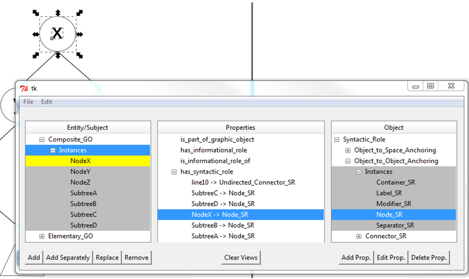

# SAI
SAI (Semantic Annotator for Inkscape) is an Inkscape extension that lets authors of semantically-annotated graphics bridge the gap between authoring vector graphics and adding semantics from a supporting ontology to their elements.



Read our [CSUN paper](http://scholarworks.csun.edu/handle/10211.3/203010) for more information.

## Install

1. Install [Inkscape](https://inkscape.org/) on your computer.
2. Ensure that the following libraries are installed on your Inkscape's Python environment:
   * `RDFLib`
   * `svg.path`
   * `Isodate`
3. To install these libraries you may use pip:
   ```bash
    > cd path/to/Inkscape
    > python.exe -m pip install -U --force-reinstall pip
    > cd bin
    > pip.exe install rdflib
    > pip.exe install isodate
    > pip.exe install svg.path
   ```
4. Copy the contents of the /SAI folder (**not** the SAI folder itself!). On your Inkscape installation directory go to share/extensions and paste the files.

## Usage

1. Run Inkscape
2. Create or load a .svg file.
3. To run SAI, go to Extensions -> Semantic -> Add Annotation. The SAI GUI will launch.
4. Go to File -> Load Ontology to load a new .rdf ontology.
5. To select SVG elements to annotate, close the SAI GUI and select the desired elements on the Inkscape canvas.
6. To annotate the selected elements, run SAI (point 3) and use the interface tree views and buttons.
7. Save the resulting ontology by going to File -> Save Ontology. Temporary changes are always kept in your home folder (viso.json file)

Watch the [video](resources/SAI-video.mp4) for a quick use overview.

